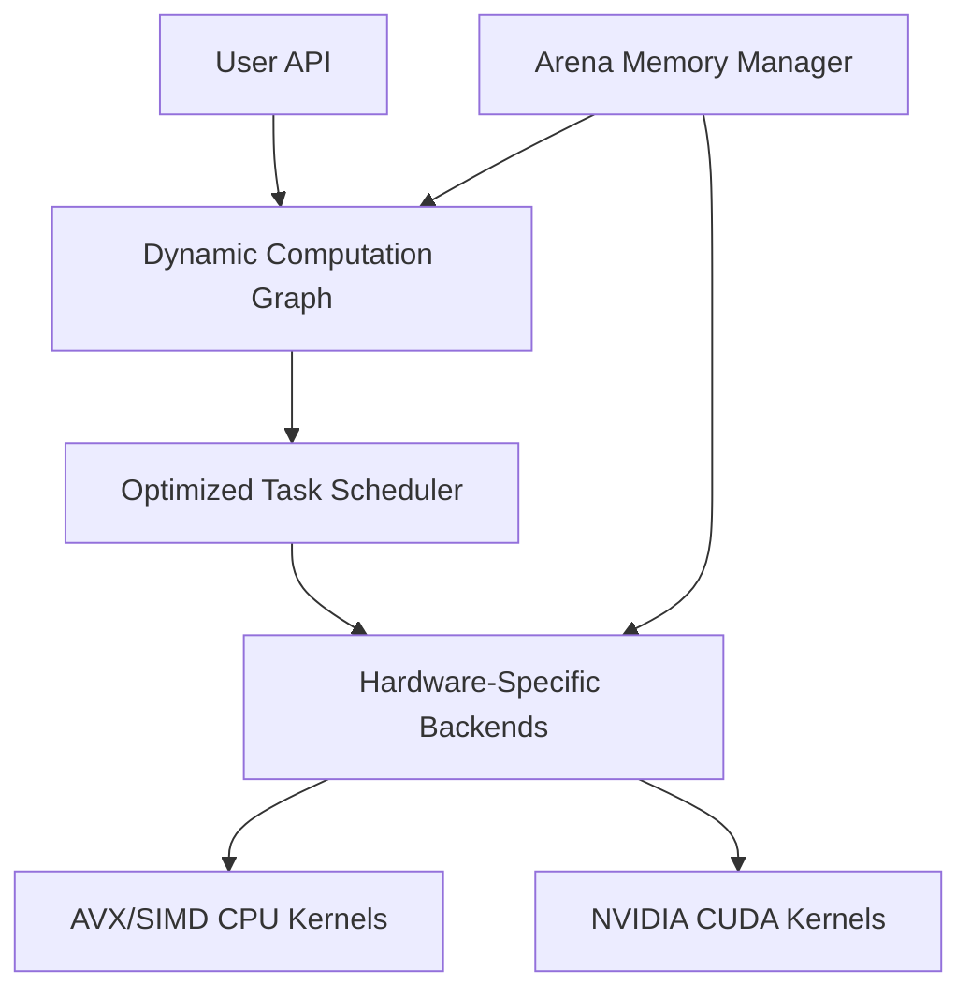

# Plast: A High-Performance Deep Learning Engine from Scratch

**Plast** is a professional-grade, zero-dependency deep learning framework built entirely from the ground up in C and CUDA. It bridges the gap between high-level AI research and low-level systems engineering, delivering a high-performance training engine that rivals the core implementations of industry standards.

## Engineering Excellence & Technical Depth

### 1. Production-Ready Autograd Engine
Plast implements a sophisticated Automatic Differentiation engine based on Dynamic Computational Graphs.
- **Topological Optimization**: Intelligently schedules operations via DAG-based topological sorting to minimize memory footprint.
- **Robust Gradient Propagation**: Advanced accumulation logic that correctly handles complex edge cases like node re-use and non-contiguous gradient flow.
- **Extensible Operator API**: A clean, decoupled architecture allows for seamless integration of new mathematical operations without graph-level changes.

### 2. High-Performance numerical Kernels
Engineered for raw throughput across heterogeneous hardware:
- **Massively Parallel CUDA Kernels**: Tiled matrix operations with shared memory optimizations, designed to exploit maximum warp occupancy and memory coalescing on NVIDIA GPUs.
- **SIMD Optimized CPU Backends**: Leverages **AVX/NEON intrinsics** and **OpenMP** multi-threading to achieve near-theoretical peak performance on modern CPUs.
- **Stride-Aware Logic**: Efficiently handles arbitrary tensor layouts (slices, transposes, views) through zero-copy "virtual" tensors and localized packing utilities.

### 3. Industrial-Grade Memory Management
Plast avoids the overhead of standard garbage collection through a custom **Arena Allocation** system:
- **Zero-Latency Training**: Pre-allocates memory for the entire computation graph, eliminating the need for `malloc/free` during the critical training path.
- **Deterministic Memory Profile**: Perfect for resource-constrained environments where predictable memory behavior is non-negotiable.
- **Cross-Device Unified Interface**: A consistent memory management layer across CPU and GPU memory spaces.

## System Architecture

## Roadmap & Future Vision
- [ ] **Python Ecosystem Integration**: CFFI/Pybind11 bindings for seamless interoperability with the broader AI ecosystem.
- [ ] **Mixed Precision Training**: Support for FP16 and BF16 to accelerate training on modern Tensor Cores.
- [ ] **Distributed High-Performance Computing**: Cluster-scale training support via MPI and NCCL.
- [ ] **Layer-Level Abstractions**: High-level modules for Conv2D, Transformers, and BatchNorm.
